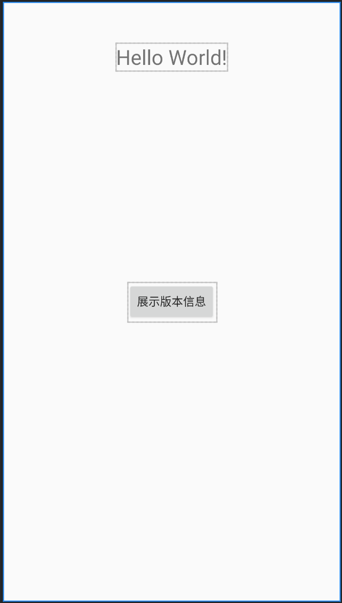

## 一、加载Dex文件



如果所示布局，点击按钮，TextView要展示当前的版本信息。

初始展示的信息是版本号`version.setText(BuildConfig.VERSION_NAME);`

然后假设加载其他dex下的信息来展示。

#### 1.生成dex

新建文件夹，统一包名路径，并新增java文件

```java
public class Test {
    public String getVersion(){
        return "Hook Version";
    }
}
```

javac编译生成class文件

然后在包名之前的目录执行dex相关命令

`dx --dex --output=test.dex com/leo/dex/Test.class`


#### 2.加载dex

将生成的dex文件push到SD卡下。提前准备好加载逻辑。

```java
public void getDex(){
    File file = new File(Environment.getExternalStorageDirectory().getPath() + "/test.dex");
    if (!file.exists()) {
        System.err.println("补丁不存在，返回");
        return;
    }
    String dexPath = file.getAbsolutePath();
    String dexOutput = getApplicationInfo().dataDir;
    String nativeLibraryDir = getApplicationInfo().nativeLibraryDir;
    DexClassLoader dexClassLoader = new DexClassLoader(
            dexPath,
            dexOutput
            , nativeLibraryDir
            , this.getClass().getClassLoader());
    try {
        Class<?> aClass = dexClassLoader.loadClass("com.leo.dex.Test");
        //反射对应方法，获取返回值
        Method getVersion = aClass.getDeclaredMethod("getVersion", new Class[]{});
        Object invoke = getVersion.invoke(aClass.newInstance(), new Object[]{});
        version.setText(String.valueOf(invoke));
    } catch (Exception e) {
        e.printStackTrace();
    }
}
```

#### 3.面向对象?

上面的代码实现加载功能是没有问题的，但是使用的时候会很不方便，每次都需要反射调用，那能不能优化一下，像对象调用方法一般去使用呢？这就需要使用接口了。

定义接口

```java
public interface IShow {
    String getShowValue();
}
```

可以定义在单独的module中，HOST和PLUGIN模块都进行依赖，或者同一份文件进行两次拷贝。

先改下Host下的逻辑

```java
public void getDex(){
        File file = new File(Environment.getExternalStorageDirectory().getPath() + "/test.dex");
        if (!file.exists()) {
            //补丁不存在，返回
            System.err.println("补丁不存在，返回");
            return;
        }
        String dexPath = file.getAbsolutePath();
        String dexOutput = getApplicationInfo().dataDir;
        String nativeLibraryDir = getApplicationInfo().nativeLibraryDir;
        DexClassLoader dexClassLoader = new DexClassLoader(
                dexPath,
                dexOutput
                , nativeLibraryDir
                , this.getClass().getClassLoader());
        try {
            Class<?> aClass = dexClassLoader.loadClass("com.leo.dex.Test");
            //Version 1
//            Method getVersion = aClass.getDeclaredMethod("getVersion", new Class[]{});
//            Object invoke = getVersion.invoke(aClass.newInstance(), new Object[]{});
//            version.setText(String.valueOf(invoke));

            //Version 2
            IShow instance = (IShow) aClass.newInstance();
            version.setText(instance.getShowValue());
        } catch (Exception e) {
            e.printStackTrace();
        }
    }
```

直接通过IShow的实例来调用相关方法，简单很多。

再修改plugin下的`Test.java`文件

```java
public class Test implements IShow{
    @Override
    public String getShowValue(){
        return "Hook Interface value";
    }
}
```

剩下的打包加载逻辑是一样的。

#### 4.热修复

加入TextView的内容一开始就是在某个类中获取，而这个类某个方法返回值出现了问题，那如何修复？

```java
IShow content = new Content();
version.setText(content.getShowValue());
```

Content这个类是系统加载的，不能再通过点击事件去加载某个class来修复了，那就太迟了。

需要在加载这个类的时候已经将它修复：

```java
public class HotFixManager {
    private static final String PATHC_DIR = Environment.getExternalStorageDirectory().getPath() + "/hotfix.dex";
    public static void installPatchDex(Context context) {
        File file = new File(PATHC_DIR);
        if (!file.exists()) {
            //补丁不存在，返回
            return;
        }
        try {

            ClassLoader loader = context.getClassLoader();
            //dalvik.system.PathClassLoader
            System.out.println(loader.getClass().getName());
            //1.获取pathList对象实例
            Field pathListField = ReflectUtil.findField(loader, "pathList");
            Object dexPathList = pathListField.get(loader);
            //2.获取makeDexElements方法
            Method makeDexElements = ReflectUtil.findMethod(dexPathList, "makeDexElements"
                    , List.class
                    , File.class
                    , List.class
                    , ClassLoader.class);
            //3.参考makeDexElements方法准备参数
//            private static Element[] makeDexElements(List<File> files, File optimizedDirectory,
//                    List<IOException> suppressedExceptions, ClassLoader loader) {
//                return makeDexElements(files, optimizedDirectory, suppressedExceptions, loader, false);
//            }
            List<File> filesToBeInstalled = new ArrayList<>();
            filesToBeInstalled.add(file);
            File optimizedDirectory = context.getDir("fixed_dex",Context.MODE_APPEND);
            if (!optimizedDirectory.exists()){
                optimizedDirectory.mkdirs();
            }
            List<IOException> exceptions = new ArrayList<>();
            //4.反射调用makeDexElements方法得到解析的dex数组
            Object[] extraElements = (Object[]) makeDexElements.invoke(dexPathList
                    , filesToBeInstalled
                    , optimizedDirectory
                    , exceptions
                    , loader);
            //5得到系统原始的Elements数组
            Field dexElementsField = ReflectUtil.findField(dexPathList, "dexElements");
            Object[] originalElements = (Object[]) dexElementsField.get(dexPathList);
            //6.合并数组,先存放patch的数组，确保系统先加载
            Object[] newElements = (Object[]) Array.newInstance(originalElements.getClass().getComponentType(), originalElements.length + extraElements.length);
            System.arraycopy(extraElements, 0, newElements, 0, extraElements.length);
            System.arraycopy(originalElements, 0, newElements, extraElements.length, originalElements.length);

            //将结果存放到系统
            dexElementsField.set(dexPathList, newElements);
        } catch (Exception e) {
            e.printStackTrace();
        }
    }
}
```

install的方法越早越好，比如在Application中：

```java
@Override
protected void attachBaseContext(Context base) {
    super.attachBaseContext(base);
    HotFixManager.installPatchDex(this);
}
```

[1.PathClassLoader源码](http://androidxref.com/9.0.0_r3/xref/libcore/dalvik/src/main/java/dalvik/system/PathClassLoader.java)

[2.BaseDexClassLoader源码](http://androidxref.com/9.0.0_r3/xref/libcore/dalvik/src/main/java/dalvik/system/BaseDexClassLoader.java#31)